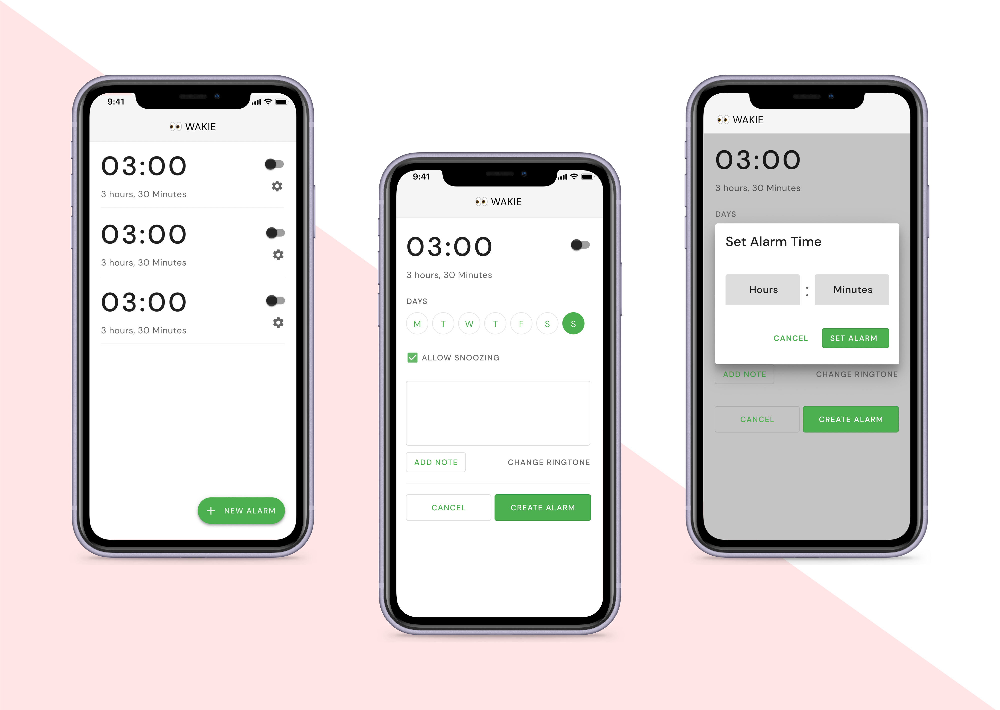
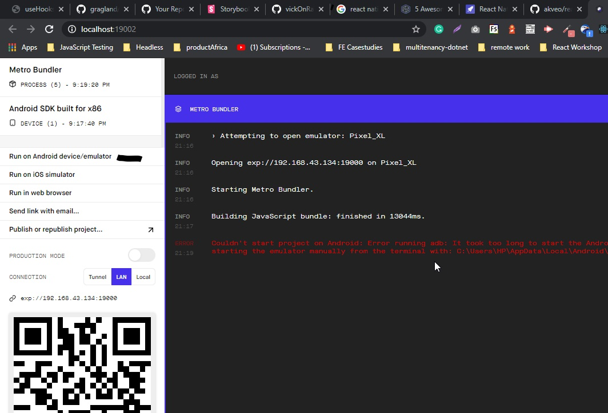
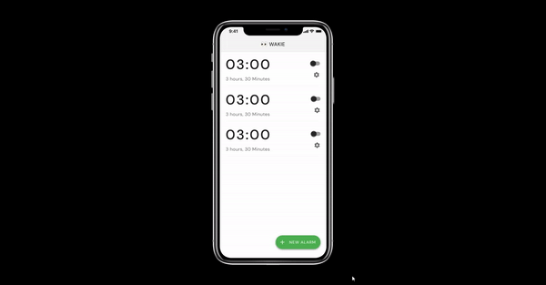

<h1 align="center">👀 CALarM</h1>

<p align="center">CALarM is a cross platform (Android & iOS) experimental alarm clock built in <a href="https://reactnative.dev">React Native</a>, bootstrapped with <a href="https://expo.io/">Expo</a></p>



## Usage

clone the project

```bash
git clone https://github.com/VGerris/calarm.git
```

cd into directory and install dependencies

```bash
cd calarm && yarn

or

cd calarm && npm install
```

Start the expo cli

```bash
expo start
```

This will open `localhost:19002` on your default browser.

The quickest way to get started is to install the expo mobile app. After installing, open the app and scan the barcode. You should be set already.



If you have your emulator setup, you can start it, click on `Run on iOS simulator` / `Run on Android device`. This will launch the app on your emulator.

> You must have expo-cli installed before any of this would work

For more extensive documentation, see the [expo documentation](https://docs.expo.io/)

## Todo

- [ ] Ship v1.0 with basic alarm features
- [ ] Add dark mode 😍



## Issues

- If you discover any issues, please create a PR with a fix or an explanation of the issue.

## Expo upgrade

yarn global add @expo/cli

npx expo upgrade

## Update yarn

corepack use yarn@4.9.4

## Running mobile 

npx expo run:ios
npx expo run:android

### Clean mobile and rebuild

// rm -rf android ios
npx expo prebuild --clean

## Thorough clean

rm -rf node_modules yarn.lock android ios .expo
yarn install

### Building apps natively
From the apps/expo subdir

#### Android:

eas build --platform android --profile production --local

brew install bundletool
bundletool build-apks --bundle=app-release.aab --output=app-release.apks
bundletool install-apks --apks=app-release.apks

OR straight apk:

eas build --platform android --profile preview2 --local
adb install /Users/vincent/develop/.../apps/expo/build-xxxxxxxxxxxxx.apk

OR from the Android direectory :
./gradlew assembleRelease

eas production builds use variables from expo.dev:
https://expo.dev/accounts/openminded/settings/environment-variables
EXPO_PUBLIC_API_URL
EXPO_PUBLIC_DEV_API_URL are for the API proxy and for local testing for example contains : http://192.168.68.69:3000

### Run Android emulator with dns :

emulator -avd Medium_Phone_API_35 -dns-server 8.8.8.8
Note : Android when referring to localhost seems to refer to itself, where iOS seems to connect to the computer localhost

#### iOS
run:
xed ios // This will open Xcode
Go to : Product - Scheme - Edit Scheme , then for Run on the left, under Info select Build Configuratio - Release
Then under issue navigator, for Signing and capabilites select a Team - then connect the phone, select it and press the 'play' button to build and install it.

### Expo upgrades, snippet from possible issue
Maybe this will help someone in the future. I ran into the same problem on expo@53.0.12, running node@24. Fixed it by removing the expo and expo-cli globally and globally updating eas:

    $ npm uninstall -g expo expo-cli eas
    $ rm -f /usr/local/bin/expo /usr/local/bin/expo-cli /usr/local/bin/eas
    $ rm -rf ~/.npm/_npx ~/.npm/_cacache

Verify, these should return nothing:

    which expo
    which expo-cli
    which eas

Then,

npm install -g eas-cli # confirm it's >=16.x.x

Old global expo CLI (v0.x) is incompatible with SDK 53 (and maybe even 52/51, can't confirm) and Node 17+.

The problem with metro.config.js went away after upgrading. Metro bundler errors were caused by mismatches between the global CLI and the project SDK.

eas-cli is still OK to keep globally, and is probably recommended, I don't know. I'm just happy I'm done with this SDK 50 -> SDK 53 migration.

## cleaning for upgrades:
In apps/expo dir:

cd ios
pod deintegrate
rm -rf Pods Podfile.lock
rm -rf ~/Library/Developer/Xcode/DerivedData/*
pod install --repo-update
cd ..

Issue with jsc / hermes runtime :
grep -R "React-RuntimeApple" ios/Pods/Manifest.lock
find ios/Pods -type d -name "React-RuntimeApple"
find ios/Pods -type f -name JSRuntimeFactory.h

### Firebase setup for local development

e.g. :

```bash
npm install -g firebase-tools
```

Or use brew on MacOS.

To update the tool suggest this:

curl -sL https://firebase.tools | upgrade=true bash
Always check the script before using that.

This generates the .firebaserc and .firebase.json files in the root (now in this repo)

NOTES:

 - the .firebaserc file should contain the project used, also when using the local emulators - they are associated with the project
 - to login to firebase and set the project ( logout only needed if logged in with wrong account ) :


 ```bash
 firebase logout && firebase login
 firebase use my-proj-in-gcp
Now using use my-proj-in-gcp
 ```